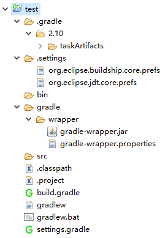

# gradel命令
一个Project是由若干tasks来组成的，当gradle xxx的时候，实际上是要求gradle执行xxx任务。这个任务就能完成具体的工作。  
cmd窗口进入项目根目录下运行。语法：gradle 参数  

## build setup系列
#### init   //初始化gradle项目   
项目下有build.gradle或settings.gradle文件则不会运行init. 根目录下原有的文件不会被改写，只会补全没有的文件。  

init --type pom //maven项目转换为gradle项目  
#### wrapper
eg: gradle wrapper --gradle-version 5.4.1 生成包装器文件,可以升级gradle wrapper版本    
1.会根据Gradle运行时的当前版本来生成包装器文件，运行会下载gradle包。生成.gradle/和gradle/+gradlew+gradlew.bat      
2.手工定制：build.gradle文件中手动建立如下，则会以如下配置生成包装器。  
  task wrapper(type:Wrapper){  
      gradleVersion = '3.5'   //指定版本  
  }    
3.注意：修改gradle- wrapper.properties的方法不行  
distributionUrl=https\://services.gradle.org/distributions/gradle-2.10-bin.zip  
2.10改成3.0后，refresh gradle project没用不会更新wrapper到3.0 原因：此文件是运行wrapper命令后生成的。  

## build系列 
#### assemble 
E:\ws_IBM\gradle_project>gradle assemble 
 :compileJava 
 :processResources UP-TO-DATE 
 :classes 
 :jar 
 :assemble 
 BUILD SUCCESSFUL
编译程序中的源代码，并打包生成Jar文件，会在build/libs目录中创建一个file-java-project.jar文件，这个任务不执行单元测试，不运行检查代码质量等的命令。  

#### build 执行一个完整的项目构建。
E:\ws_IBM\gradle_project>gradle build  
 :compileJava  
 :processResources  
 :classes  
 :jar  
 :assemble   
 :compileTestJava  
 :processTestResources  
 :testClasses  
 :test  
 :check  
 :build  
 BUILD SUCCESSFUL 
build任务会执行一个完整的项目构建。 
任务执行项目打包所必须的任务集，以及执行自动化测试。和assemble一样会在build/libs目录中创建一个file-java-project.jar文件。默认创建的Jar文件名称是由这   
个模版决定的：[projectname].jar，此外，项目的默认名称和其所处的目录名称是一致的。因此如果你的项目目录名称是first-java-project，那么创建的Jar文件名称就   
是first-java-project.jar。这里需要说明一点的是 Gradle 是增量式编译的，只编译那些有变动的 java 类或资源文件的，如 UP-TO-DATE 表示该任务被跳过去了。  

gradle build -x test   // gradle 跳过测试直接编译  

#### buildDependents

#### buildNeeded

#### classes

#### clean  会删除构建目录build。
#### jar
#### testClasses
#### war

## documentation系列
javadoc 生成javadoc   
   
## help系列
#### buildEnvironment
#### components
#### dependencies
#### dependencyInsight
#### help
#### model
#### projects
#### properties
列出一个可配置标准和插件属性的列表，同时还会显示它们的默认值。    
#### tasks
参数：[-q]  以quiet模式运行。  
[--all]  列出所有的，任务组下面的任务。  
还可以gradle project-path:tasks   
//project-path是目录名，后面必须跟冒号。  
1.得到一个可运行任务及其描述的完整列表  
2.在非项目目录和项目根目录下运行结果不一样  
  
## Verification系列   
#### check
编译 java 文件并运行那些类似 Checkstyle，PMD 等外部插件命令来检查我们自己的源代码，而不打成 jar 包。  
E:\ws_IBM\gradle_project>gradle check  
 :compileJava UP-TO-DATE  
 :processResources UP-TO-DATE  
 :classes UP-TO-DATE  
 :compileTestJava UP-TO-DATE  
 :processTestResources UP-TO-DATE  
 :testClasses UP-TO-DATE  
 :test UP-TO-DATE   
 :check UP-TO-DATE   

 BUILD SUCCESSFUL  
#### test 

## 多项目构建相关系列  
project  查看multi projects包含几个子prlject  

## web application  用了jetty插件才会出现(已淘汰) 
jettyRun		
jettyRunWar	 	
jettyStop		
